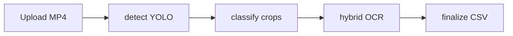

# Демо и презентация — тезисы

Используйте этот файл как опорный конспект для слайдов. План файл не дублируется.

## 1. Задача

- Видео робота вдоль полки → детекция ценников → OCR/QR → CSV по контракту хакатона.
- Одна строка на **уникальный** физический ценник; пустое поле = не распознано, «нет» = отсутствует на ценнике.
- Локальный контур без облачных API; UI: загрузка видео и скачивание результата.

## 2. Входные данные и сложность

- Смешанный свет, блики, углы, перекрытия, стекло (из PDF задания).
- Много шаблонов и механик: РПЦ/акция/распродажа, от/до N, BOGOF, МНЦ, размеры 6×6, 6×12, A5–A2, вертикаль/горизонт (из «ГМ для ТК»).
- Семь базовых раскладок полей на ценнике (из «Расшифровка ценники»).

## 3. Архитектура решения

- **BFF**: FastAPI + SQLite + RabbitMQ, очередь стадий `detect → classify → ocr → finalize`.
- **detect**: ffmpeg кадры + Ultralytics YOLO, веса `lenta-hackathon-main/weights/*.pt`.
- **classify**: фильтр по confidence, временной precluster боксов, вырезка кропов, smart deskew, опционально super-res (FSRCNN/EDSR `.pb`).
- **ocr**: гибридный парсер по манифесту кропов (Paddle/Rapid по `ML_ENGINE`).
- **finalize**: сборка CSV, штрихкод/QR enrichment, **дедупликация** (`tag_dedupe.py`, spatial + IoU + качество строки).
- **Диагностика потерь**: на каждом этапе (filter, precluster, dedupe) сохраняются per-frame CSV (`per_frame_filtered_counts.csv`, `per_frame_precluster_counts.csv`, `*_per_frame_final_counts.csv`) и агрегированный `crop_stats` в `result.json`. Это позволяет быстро понять, на каком кадре и на каком этапе теряются детекции.

Краткая схема:

## 4. Что показать в UI

- Главная `/`: загрузка файла, `job_id`, опрос статуса, ссылки на `result.csv` и JSON.
- `/health` и `/health/ml`: брокер и наличие весов/скриптов.

## 5. Метрики и честность

- Внутри бандла: отдельно **honest holdout** и **merged/internal** веса; для отчёта на хакатоне явно объявить, какой `.pt` и как считалась метрика (см. `lenta-hackathon-main/HACKATHON_RUNBOOK.md`, `README_BACKEND.md`).
- Узкие места: имя товара, штрихкод, QR на плохих кропах — из runbook.

## 6. Масштабирование

- Параметры окружения: stride, imgsz, conf, dedupe spatial, upscale on/off.
- Деплой: Docker Compose (RabbitMQ + API + 4 воркера); данные в `./data`.
- Дальше: экспорт детектора в int8 / rknn для edge (из ТЗ как плюс).

## 7. Ограничения (честно на слайде)

- Зависимость от качества кадра и заполнения кропа штрихкодом/QR.
- Разные шаблоны требуют устойчивого template/ROI или end-to-end; текущий путь — гибрид правил + OCR.
- Тяжёлые стадии (OCR, upscale) — нагрузка на CPU/GPU; FSRCNN легче EDSR.
